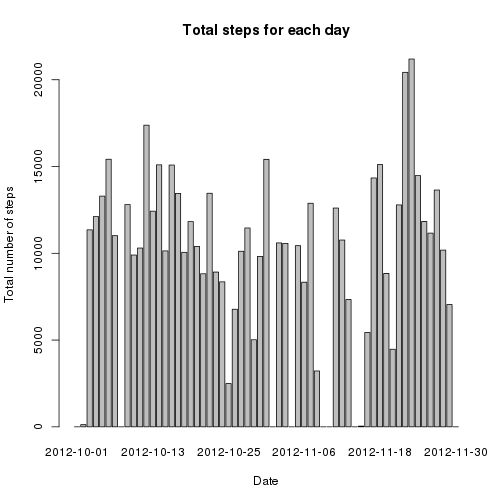
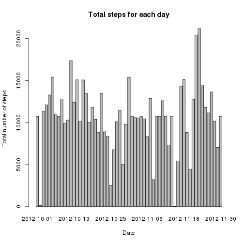
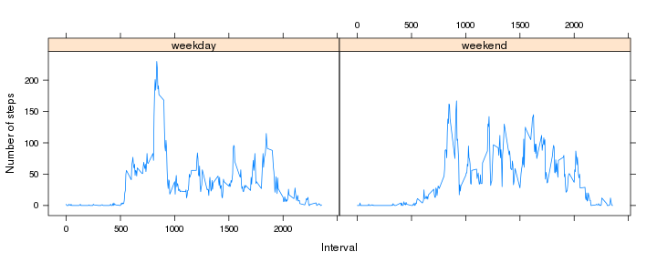

# Reproducible Research: Peer Assessment 1


## Loading and preprocessing the data

```r
activity <- read.csv(unzip("activity.zip"))
activity$date <- as.Date(activity$date, "%Y-%m-%d")
```


## What is mean total number of steps taken per day?

```r
# Split the activities per day
days <- cut(activity$date, "day")
daily.activity <- split(activity, days)

# Calculate and plot the daily total steps
steps.sum <- sapply(daily.activity, function(x) {
    sum(x$steps, na.rm = TRUE)
})
hist(steps.sum, breaks = 10, main = "Total Daily Steps", xlab = "Daily steps")
```

 

```r
barplot(steps.sum, names.arg = names(steps.sum), main = "Total steps for each day", 
    xlab = "Date", ylab = "Total number of steps")
```

 

```r

# Report mean and median total daily steps
steps.mean <- round(mean(steps.sum))
steps.median <- median(steps.sum)

print(paste("Total daily steps mean =", steps.mean, ", median =", steps.median))
```

```
## [1] "Total daily steps mean = 9354 , median = 10395"
```


## What is the average daily activity pattern?

```r
# Split the data by the 5-minutes interval across all days
activity.5min <- split(activity, activity$interval)

# Calculate and plot the average steps per every 5-minutes interval
mean.5min <- sapply(activity.5min, function(x) {
    round(mean(x$steps, na.rm = T))
})

plot(unique(activity$interval), mean.5min, type = "l", main = "Daily Activity Pattern", 
    xlab = "5-minutes interval", ylab = "Average Steps")
```

 

```r

# mean.5min is a named vector where the name is the interval and the value
# is the average steps
max.indx <- which.max(mean.5min)
max.interval <- names(mean.5min[max.indx])
max.value <- mean.5min[max.indx]
```


The interval with maximum number of steps is **835**, with average steps = **206**

## Imputing missing values

The process of imputing missing values has three main steps:

1. Create a data frame with all records with incomplete cases in the activity data frame

2. Loop over all intervals in the incomplete data frame and fill the data from the interval mean number of steps

3. Create a new data frame from the original data and replace the steps with one filled in step 2


```r
# Get the rows with incomplete cases i.e. has NA
incomplete <- activity[is.na(activity$steps), ]
na.count <- nrow(incomplete)

# Create a new data.frame from activity
activity.complete <- activity

# Get intervals with incomplete data
intervals <- unique(incomplete$interval)

# Fill missing data with the interval mean that was calculated previously
# i.e. mean.5min
for (i in 1:length(intervals)) {
    incomplete[incomplete$interval == intervals[i], "steps"] <- mean.5min[which(names(mean.5min) == 
        intervals[i])]
}

activity.complete[is.na(activity$steps), ] <- incomplete  # now already completed

new.steps.sum <- sapply(split(activity.complete, days), function(x) {
    sum(x$steps)
})
hist(new.steps.sum, breaks = 10, main = "Total Daily Steps with Imputed Values", 
    xlab = "Daily steps")
```

 

```r
barplot(new.steps.sum, names.arg = names(new.steps.sum), main = "Total steps for each day", 
    xlab = "Date", ylab = "Total number of steps")
```

 

```r

# Report mean and median total daily steps
new.steps.mean <- round(mean(new.steps.sum))
new.steps.median <- median(new.steps.sum)

print(paste("After imputing missing values, the total daily steps mean =", new.steps.mean, 
    ", median =", new.steps.median))
```

```
## [1] "After imputing missing values, the total daily steps mean = 10766 , median = 10762"
```


It is clear that after imputing missing values the total number of steps increased particularly the daily total steps mean increased by **1412** and the median increased by **367** steps. Also, the histogram shape is more close to the normal distribution.


## Are there differences in activity patterns between weekdays and weekends?


```r

# Create a new variable 'day' to indicate weekday or weekend
activity.complete$day <- "weekday"
activity.complete[weekdays(activity.complete$date) %in% c("Saturday", "Sunday"), 
    "day"] <- "weekend"
activity.complete$day <- as.factor(activity.complete$day)

# activity.5min is a factor that splits the data by the interval
activity.5min <- split(activity.complete, activity.complete$interval)

# Calculate the 5-minutes average steps for weekdays and weekends separately
mean.5min.wday <- sapply(activity.5min, function(x) {
    round(mean(x[x$day == "weekday", "steps"]))
})
mean.5min.wend <- sapply(activity.5min, function(x) {
    round(mean(x[x$day == "weekend", "steps"]))
})

# Create a new data frame for the activity pattern with the above calcuated
# means
activity.pattern <- data.frame(mean.5min = mean.5min.wday, interval = as.numeric(names(mean.5min.wday)), 
    day = "weekday")
activity.pattern <- rbind(activity.pattern, data.frame(mean.5min = mean.5min.wend, 
    interval = as.numeric(names(mean.5min.wend)), day = "weekend"))
activity.pattern$day <- as.factor(activity.pattern$day)

require(lattice)
```

```
## Loading required package: lattice
```

```r
xyplot(mean.5min ~ interval | day, data = activity.pattern, type = "l", xlab = "Interval", 
    ylab = "Number of steps")
```

 


The activity pattern in weekdays is clearly different from weekends. In weekdays, it seems that the morning period has a visible peak in the activity and the activities start earlier in the morning which is expected for a typical working day. In weekends, the activities is distributed across the day with a later start compared to weekdays. However, the average steps in weekends is higher than weekdays with values **42 and 36** steps respectively
